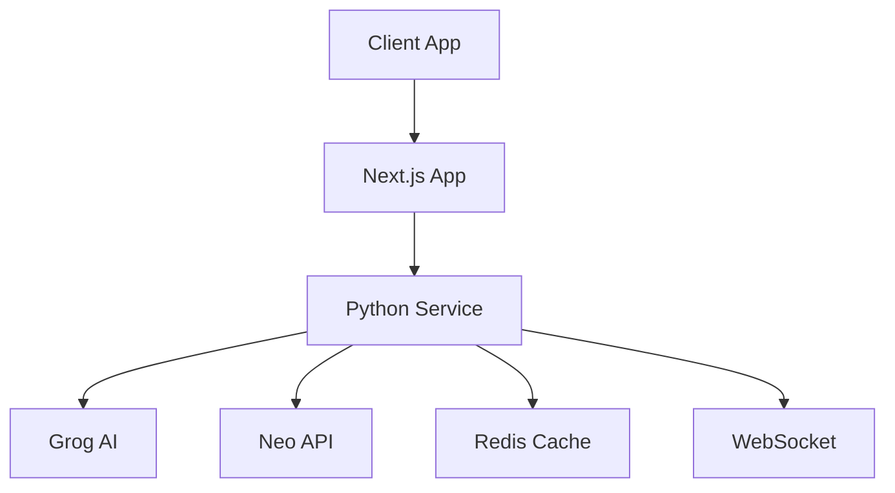

# Neon Nexus AI Chat 🤖

<div align="center">

<a href="https://web.89281112.xyz/project9/" target="_blank">
  
</a>

</div>

Cyberpunk-themed AI chat interface with real-time AI detection metrics and analysis.

## 🌟 Features

### Current Features
- 🤖 Dual-layer AI processing (Grog AI + Neo API)
- 📊 Real-time AI detection metrics
- ⚡ WebSocket updates
- 💾 Redis caching
- 🐳 Docker deployment
- 🧪 Full test coverage

### Technical Stack
- Next.js 15.0 (Frontend)
- Python 3.12 (Backend)
- Redis
- WebSocket
- Docker

## 🚀 Quick Start

### Backend
```bash
# Clone repository
git clone https://github.com/your-repo/neon-nexus.git
cd neon-nexus

# Setup environment
cp .env.example .env
# Edit .env with your API keys

# Start services
./scripts/docker.sh --start
```

### Frontend
```bash
# Install dependencies
pnpm install

# Development
pnpm dev

# Production
pnpm build
pnpm start
```

## 🌍 Environment Setup

```env
GROG_API_KEY=your_grog_api_key
NEO_API_KEY=your_neo_api_key
REDIS_PASSWORD=your_redis_password
```

## 📚 Documentation

### Core Documentation
- [API Documentation](./docs/API.md) - API architecture and endpoints
- [Infrastructure Guide](./docs/INFRASTRUCTURE.md) - Deployment and infrastructure
- [Neo API Integration](./docs/NEO_API_INTEGRATION.md) - Neo API details
- [Metrics Analysis](./docs/METRICS_ANALYSIS.md) - Metrics and analysis
- [Development Roadmap](./docs/ROADMAP.md) - Future plans and features

### Technical Guides
- [Grog AI Models](./docs/GROG.md) - Available AI models
- [Service README](./src/service/README.md) - Backend service details
- [Development Backlog](./src/BACKLOG.md) - Current progress

## 🔄 Architecture



## 🧪 Testing

```bash
# Run service tests
cd src/service
./venv.sh  # Setup Python environment
pytest     # Run unit tests

# Run Docker integration tests
./scripts/docker.test.sh
```

## 🔒 Security

- API key management
- Request validation
- Error handling
- Redis security
- WebSocket validation

## 🤝 Contributing

1. Fork the repository
2. Create your feature branch
3. Run tests: `./scripts/docker.test.sh`
4. Create a Pull Request

## 📜 License

MIT License - feel free to use this project for any purpose.

## 🔮 Vision

Neon Nexus AI Chat aims to provide real-time AI content analysis and metrics visualization in a cyberpunk-themed interface.

---
Built with 💚 by Cyberpunk Enthusiasts
