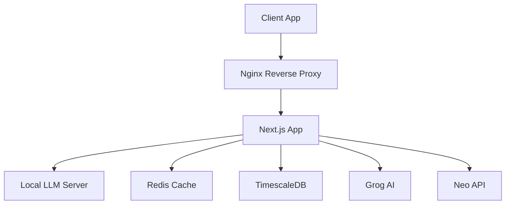

# Neon Nexus AI Chat 🤖

Cyberpunk-themed AI chat interface with neural network integration, advanced metrics analysis, and futuristic design.

## 🌟 Features

### Current Features
- 🤖 Multi-layer AI processing (Grog AI, Local LLM, Neo API)
- 🎨 Dynamic animated background with cyberpunk aesthetics
- 💻 Advanced console terminal interface
- 👤 Cyber personal account dashboard
- 🔄 Adaptive chat personalities
- ⚡ Real-time message updates
- 🌐 Production-ready deployment
- 📊 Advanced metrics analysis
- 💎 NeoCredits reward system
- 🎮 Achievement system

### Technical Stack
- Next.js 15.0
- TypeScript
- Framer Motion
- Tailwind CSS
- Feature-Sliced Design (FSD)
- TimescaleDB for metrics
- Redis for caching
- Docker infrastructure

## 🚀 Development Roadmap

### Phase 1: Core Enhancement
- [ ] Full Neo API integration
- [ ] Advanced metrics collection
- [ ] Real-time content verification
- [ ] Custom detection sensitivity
- [ ] Analytics dashboard

### Phase 2: Advanced Features
- [ ] Neural network training interface
- [ ] Custom AI personality creation
- [ ] Multi-language support
- [ ] Voice interface integration
- [ ] Virtual reality mode

### Phase 3: System Integration
- [ ] Blockchain integration
- [ ] Decentralized storage
- [ ] AI model fine-tuning
- [ ] Advanced security
- [ ] API marketplace

## 🛠 Installation

```bash
# Install dependencies
pnpm install

# Development
pnpm dev

# Production build
pnpm build

# Start production server
pnpm start
```

## 🌍 Environment Setup

```env
GROG_API_KEY=your_grog_api_key
NEO_API_KEY=your_neo_api_key
DB_PASSWORD=your_db_password
GRAFANA_PASSWORD=your_grafana_password
```

## 📚 Documentation

### Architecture & Infrastructure
- [API Documentation](./docs/API.md) - API architecture and endpoints
- [Infrastructure Guide](./docs/INFRASTRUCTURE.md) - Deployment and infrastructure
- [Neo API Integration](./docs/NEO_API_INTEGRATION.md) - Neo API details
- [Metrics Analysis](./docs/METRICS_ANALYSIS.md) - Metrics and analysis

### Features & Systems
- [Grog AI Models](./docs/GROG.md) - Available AI models
- [Goals System](./docs/GOALS.md) - Achievements and rewards
- [Monetisation](./docs/MONETISATION.md) - Pricing and features

## 💰 Monetisation Model

### Free Tier
- Basic chat functionality
- Standard response time
- Console access
- Basic metrics

### Premium Tier ($9.99/month)
- Priority processing
- Premium models
- Media processing
- Custom themes

### Sponsor Tier ($49.99/month)
- Experimental features
- Custom model training
- Ultra-fast streaming
- Special access

See [Monetisation](./docs/MONETISATION.md) for full details.

## 🎯 Achievement System

Users can earn NeoCredits (NC) through:
- Quality conversations
- Unique interactions
- System achievements
- Special events

See [Goals System](./docs/GOALS.md) for details.

## 🔧 Infrastructure



See [Infrastructure Guide](./docs/INFRASTRUCTURE.md) for deployment details.

## 🧪 Testing

```bash
# Run API tests
./scripts/test-api.sh

# Run integration tests
./scripts/test-integration.sh

# Run metrics tests
./scripts/test-metrics.sh
```

## 🔒 Security

- Rate limiting
- API key rotation
- Request validation
- Error handling
- Audit logging

## 🤝 Contributing

1. Fork the repository
2. Create your feature branch
3. Commit your changes
4. Push to the branch
5. Create a Pull Request

## 📜 License

MIT License - feel free to use this project for any purpose.

## 🔮 Vision

The Neon Nexus AI Chat aims to become a fully immersive cyberpunk communication platform, bridging human interaction and artificial intelligence in a stylized, futuristic environment.

---
Built with 💚 by Cyberpunk Enthusiasts