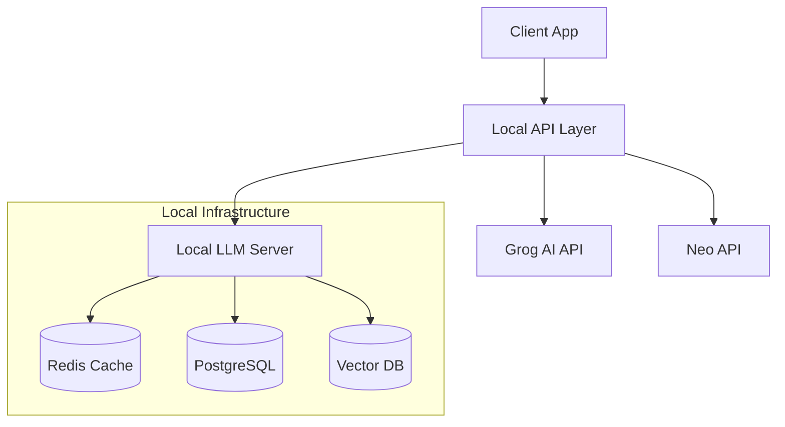
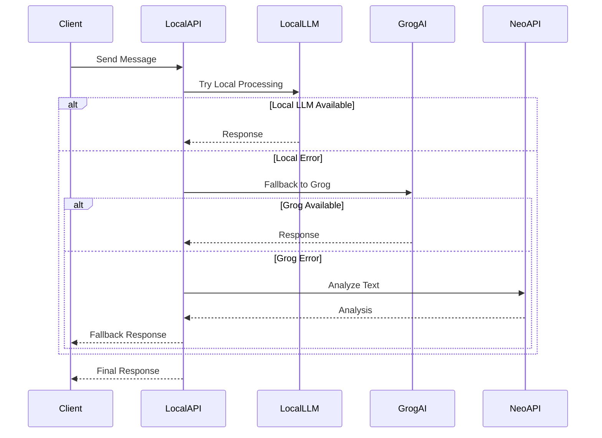

# Neon Nexus API Architecture

## Overview

The system uses a three-tier API architecture:
1. Local LLM Server
2. Grog AI Integration
3. Neo API Integration



## Infrastructure Components

### Docker Configuration

```yaml:docker-compose.yml
version: '3.8'

services:
  app:
    build: .
    ports:
      - "3001:3001"
    environment:
      - NODE_ENV=production
      - GROG_API_KEY=${GROG_API_KEY}
      - NEO_API_KEY=${NEO_API_KEY}
    depends_on:
      - postgres
      - redis
      - llm-server

  llm-server:
    build: ./llm
    ports:
      - "8000:8000"
    volumes:
      - ./models:/app/models
    environment:
      - MODEL_PATH=/app/models/llama-2-7b
    deploy:
      resources:
        reservations:
          devices:
            - driver: nvidia
              count: 1
              capabilities: [gpu]

  postgres:
    image: postgres:15
    ports:
      - "5432:5432"
    environment:
      - POSTGRES_USER=neonexus
      - POSTGRES_PASSWORD=${DB_PASSWORD}
      - POSTGRES_DB=neonexus
    volumes:
      - postgres_data:/var/lib/postgresql/data

  redis:
    image: redis:7
    ports:
      - "6379:6379"
    volumes:
      - redis_data:/data

  vector-db:
    image: qdrant/qdrant
    ports:
      - "6333:6333"
    volumes:
      - vector_data:/qdrant/storage

volumes:
  postgres_data:
  redis_data:
  vector_data:
```

### Database Schema

```sql
-- Chat History
CREATE TABLE chat_messages (
    id UUID PRIMARY KEY DEFAULT gen_random_uuid(),
    session_id UUID NOT NULL,
    role VARCHAR(50) NOT NULL,
    content TEXT NOT NULL,
    embedding VECTOR(1536),
    created_at TIMESTAMP WITH TIME ZONE DEFAULT CURRENT_TIMESTAMP,
    metadata JSONB
);

-- Analysis Results
CREATE TABLE analysis_results (
    id UUID PRIMARY KEY DEFAULT gen_random_uuid(),
    message_id UUID REFERENCES chat_messages(id),
    neo_score FLOAT,
    grog_response JSONB,
    metrics JSONB,
    created_at TIMESTAMP WITH TIME ZONE DEFAULT CURRENT_TIMESTAMP
);

-- User Sessions
CREATE TABLE sessions (
    id UUID PRIMARY KEY DEFAULT gen_random_uuid(),
    user_agent TEXT,
    ip_address INET,
    created_at TIMESTAMP WITH TIME ZONE DEFAULT CURRENT_TIMESTAMP,
    last_active TIMESTAMP WITH TIME ZONE DEFAULT CURRENT_TIMESTAMP
);
```

## API Flow

### 1. Local LLM Server

```typescript
interface LocalLLMRequest {
  text: string;
  options?: {
    temperature?: number;
    maxTokens?: number;
    stream?: boolean;
  };
}

interface LocalLLMResponse {
  text: string;
  usage: {
    promptTokens: number;
    completionTokens: number;
    totalTokens: number;
  };
}
```

### 2. Grog AI Integration

```typescript
interface GrogRequest {
  messages: Array<{
    role: string;
    content: string;
  }>;
  systemInstruction: string;
}

interface GrogResponse {
  choices: Array<{
    message: {
      content: string;
    };
  }>;
}
```

### 3. Neo API Integration

```typescript
interface NeoRequest {
  text: string;
  full_metrics: boolean;
}

interface NeoResponse {
  analysis_id: string;
  is_ai_generated: boolean;
  metrics: {
    text_coherence_complexity: Record<string, number>;
    readability_metrics: Record<string, number>;
    vocabulary_lexical_diversity: Record<string, number>;
  };
}
```

## Fallback Strategy



## Cache Strategy

```typescript
interface CacheConfig {
  localTTL: number;        // 1 hour
  grogTTL: number;         // 24 hours
  neoTTL: number;          // 7 days
  maxSize: number;         // 1GB
}

interface CacheEntry {
  data: any;
  source: 'local' | 'grog' | 'neo';
  createdAt: Date;
  expiresAt: Date;
}
```

## Environment Setup

```bash
# Local Development
docker-compose -f docker-compose.dev.yml up

# Production
docker-compose -f docker-compose.prod.yml up -d

# LLM Model Download
./scripts/download-models.sh

# Database Migration
npm run migrate
```

## Monitoring

```yaml:prometheus.yml
scrape_configs:
  - job_name: 'neonexus'
    static_configs:
      - targets: ['localhost:3001']
    metrics_path: '/metrics'
```

## Security

1. Rate Limiting
2. API Key Rotation
3. Request Validation
4. Error Handling
5. Audit Logging

## Future Improvements

1. Distributed LLM Processing
2. Model Fine-tuning Pipeline
3. Advanced Caching Strategies
4. Real-time Analytics
5. A/B Testing Framework

---

For implementation details, see:
- [NEO_API_INTEGRATION.md](./NEO_API_INTEGRATION.md)
- [METRICS_ANALYSIS.md](./METRICS_ANALYSIS.md)
