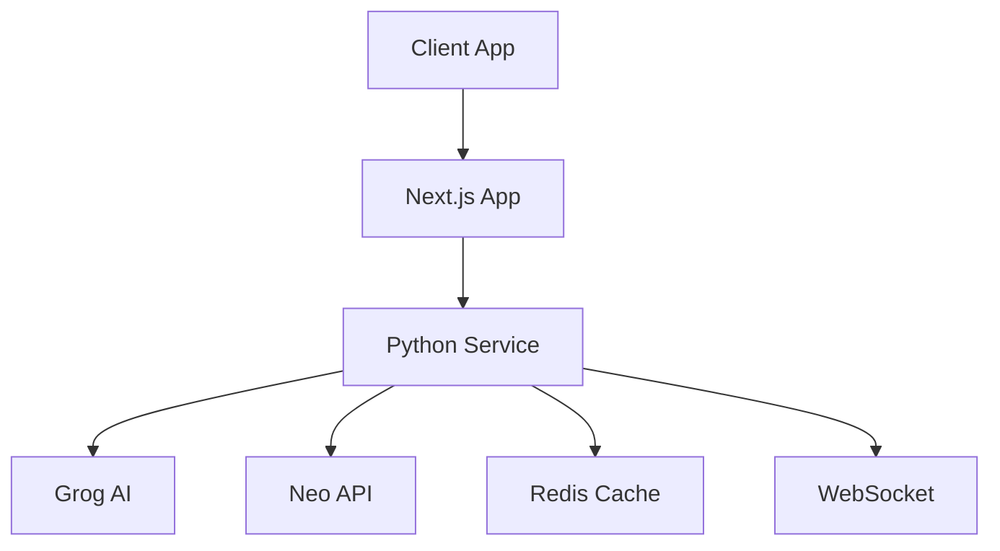
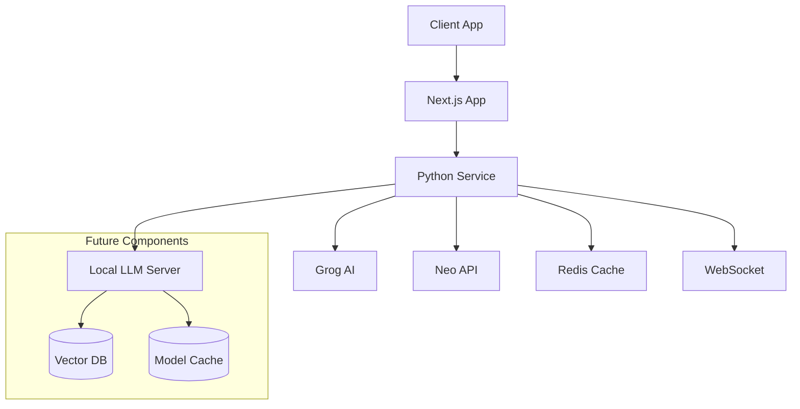

# Neon Nexus API Architecture

## Current Architecture



## Service Components

### 1. Python Service
```typescript
interface ServiceConfig {
  httpPort: 8000;
  wsPort: 8001;
  redis: {
    host: string;
    port: number;
  };
}
```

### 2. Redis Cache
```typescript
interface CacheConfig {
  messagesTTL: number;  // 24 hours
  metricsTTL: number;   // 7 days
}
```

### 3. WebSocket
```typescript
interface WebSocketMessage {
  type: "metrics" | "status";
  data: any;
}
```

## Current Infrastructure

```yaml:docker-compose.yml
version: '3.8'

services:
  service:
    build: .
    ports:
      - "8000:8000"
      - "8001:8001"
    environment:
      - GROG_API_KEY=${GROG_API_KEY}
      - NEO_API_KEY=${NEO_API_KEY}
    depends_on:
      - redis

  redis:
    image: redis:7
    ports:
      - "6379:6379"
    volumes:
      - redis_data:/data

volumes:
  redis_data:
```

## Future Plans: Local LLM Integration

### Local LLM Server (Planned)
```typescript
interface LocalLLMConfig {
  model: string;
  maxTokens: number;
  temperature: number;
  gpu: boolean;
}
```

### Extended Infrastructure (Future)


## Current API Flow

### 1. Message Processing
```typescript
interface ChatRequest {
  message: string;
}

interface ChatResponse {
  id: string;
  message: string;
  metrics: {
    is_ai_generated: boolean;
    human_likeness_score: number;
    // ... other metrics
  };
}
```

### 2. Metrics Broadcasting
```typescript
interface MetricsUpdate {
  type: "metrics";
  data: {
    messageId: string;
    metrics: Record<string, any>;
  };
}
```

## Error Handling

```typescript
interface ErrorResponse {
  status: "error";
  error: string;
  details?: string;
}
```

## Security

1. **Current**
   - API Key Management
   - Request Validation
   - Redis Security
   - WebSocket Validation

2. **Planned**
   - Local Model Security
   - Advanced Authentication
   - Rate Limiting
   - Audit Logging

---

For implementation details, see:
- [INFRASTRUCTURE.md](./INFRASTRUCTURE.md)
- [NEO_API_INTEGRATION.md](./NEO_API_INTEGRATION.md)
