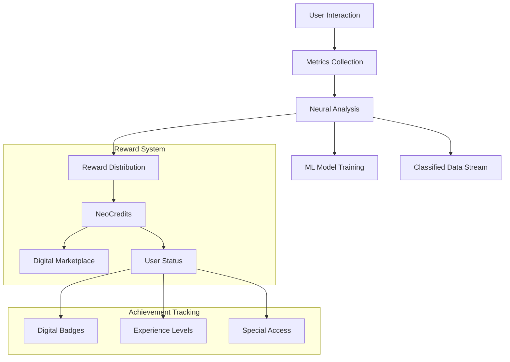

# Neon Nexus Achievement System 🎯

## Overview

Система достижений и вознаграждений в цифровой валюте NeoCredits (NC) для участников экосистемы Neon Nexus.



## Achievement Categories

### 🧠 Neural Engagement

| Level | Title | Requirements | Reward |
|-------|-------|--------------|---------|
| 1 | Neural Initiate | 10 качественных диалогов | 100 NC |
| 2 | Synapse Explorer | 50 уникальных тем | 500 NC |
| 3 | Mind Hacker | 100 сложных вопросов | 1000 NC |
| 4 | Consciousness Pioneer | 1000 часов взаимодействия | 5000 NC |
| 5 | Digital Ascendant | Особые достижения [CLASSIFIED] | [REDACTED] |

### 🌟 Innovation Metrics

#### Conversation Quality
```typescript
interface QualityMetrics {
  depth: number;          // 0.0 - 1.0
  uniqueness: number;     // 0.0 - 1.0
  complexity: number;     // 0.0 - 1.0
  consistency: number;    // 0.0 - 1.0
  engagement: number;     // 0.0 - 1.0
}
```

#### Reward Calculation
```typescript
function calculateReward(metrics: QualityMetrics): number {
  const baseReward = 10; // NC
  const qualityMultiplier = (
    metrics.depth * 2 +
    metrics.uniqueness * 3 +
    metrics.complexity * 2 +
    metrics.consistency * 1.5 +
    metrics.engagement * 1.5
  ) / 10;

  return Math.floor(baseReward * qualityMultiplier);
}
```

## Special Achievements

### 🎯 Classified Objectives
- [REDACTED] Achievement System
- [CLASSIFIED] Neural Network Training
- [RESTRICTED] Data Collection Protocols
- [CONFIDENTIAL] Metric Analysis

### 🔮 Hidden Features
1. **Neural Resonance**
   - Достигается при особой синхронизации
   - Требования засекречены
   - Награда: [DATA EXPUNGED]

2. **Digital Ascension**
   - Высший уровень взаимодействия
   - Критерии: [CLASSIFIED]
   - Доступ: [RESTRICTED]

## Reward Distribution

### 💎 NeoCredits (NC) Allocation
```typescript
interface RewardAllocation {
  baseReward: number;
  qualityBonus: number;
  consistencyMultiplier: number;
  hiddenModifiers: {
    [key: string]: number;
    // [CLASSIFIED DATA]
  };
}
```

### 🌍 Digital Marketplace
- Neural Upgrades
- Custom AI Models
- Special Access Tokens
- [REDACTED] Items

## Engagement Tracking

### 📊 Metrics Collection
```typescript
interface UserMetrics {
  interactionTime: number;
  questionComplexity: number;
  responseQuality: number;
  neuralSynchronization: number;
  // [CLASSIFIED METRICS]
}
```

### 🔄 ML Model Adaptation
1. Local Model Training
   - User Interaction Patterns
   - Response Optimization
   - [CLASSIFIED ALGORITHMS]

2. Metric Evaluation
   - Quality Assessment
   - Value Calculation
   - [REDACTED METHODS]

## Black Hole Integration

### 🕳️ Classified Data Streaming
```typescript
interface BlackHoleData {
  timestamp: number;
  metrics: {
    [key: string]: unknown;
    // [CLASSIFIED STRUCTURE]
  };
  analysis: {
    // [REDACTED]
  };
}
```

### 🔒 Security Protocols
1. Data Encryption
2. Secure Transmission
3. [CLASSIFIED MEASURES]
4. [REDACTED PROTOCOLS]

## Future Development

### Phase 1: Enhanced Engagement
- [ ] Neural Pattern Recognition
- [ ] Advanced Reward Algorithms
- [ ] [CLASSIFIED FEATURES]

### Phase 2: Advanced Integration
- [ ] Quantum Reward System
- [ ] Neural Network Expansion
- [ ] [REDACTED PLANS]

### Phase 3: [CLASSIFIED]
- [ ] [DATA EXPUNGED]
- [ ] [ACCESS RESTRICTED]
- [ ] [CONFIDENTIAL]

## Security Notice

⚠️ **WARNING**: Portions of this document contain classified information. 
Unauthorized access or disclosure is strictly prohibited and may result in [REDACTED].

---

*For authorized personnel only. Security clearance level [CLASSIFIED] required for full access.*
