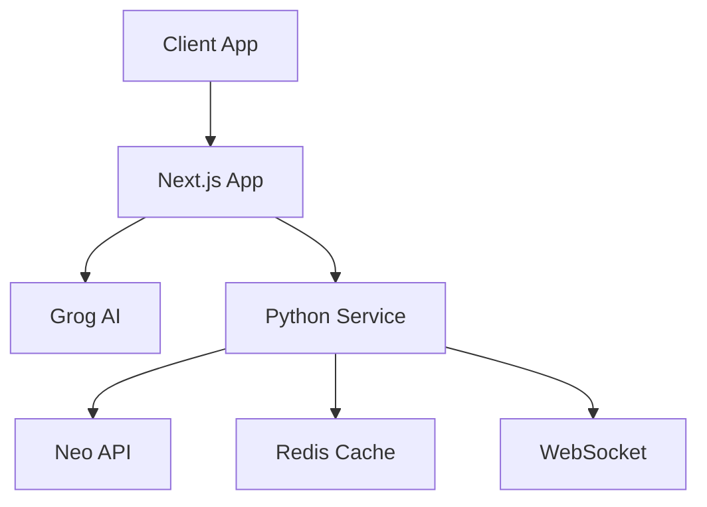

# Neon Nexus Infrastructure Guide

## Overview



## Docker Infrastructure

```yaml:docker-compose.yml
version: '3.8'

services:
  service:
    build: .
    ports:
      - "8000:8000"
      - "8001:8001"
    environment:
      - GROG_API_KEY=${GROG_API_KEY}
      - NEO_API_KEY=${NEO_API_KEY}
    depends_on:
      - redis

  redis:
    image: redis:7
    ports:
      - "6379:6379"
    volumes:
      - redis_data:/data

volumes:
  redis_data:
```

## Service Components

### 1. Python Service
- HTTP API (port 8000)
- WebSocket Server (port 8001)
- Grog AI Integration
- Neo API Integration
- Redis Cache

### 2. Redis Cache
- Message History
- Metrics Cache
- Session Data

### 3. WebSocket
- Real-time Metrics
- Client Notifications
- Status Updates

## Testing Infrastructure

```bash
# API Tests
./scripts/docker.test.sh

# Component Tests
- Redis Connection
- WebSocket Handshake
- Service Health
- API Endpoints
```

## Security Measures

1. **API Security**
   - API Key Management
   - Request Validation
   - Error Handling

2. **Data Security**
   - Redis Password
   - WebSocket Validation
   - CORS Settings

## Monitoring

1. **Service Health**
   - /health Endpoint
   - Component Status
   - Error Logging

2. **Redis Monitoring**
   - Connection Status
   - Cache Usage
   - Performance Metrics

## Future Improvements

1. **Scaling**
   - Load Balancing
   - Redis Cluster
   - Service Replication

2. **Monitoring**
   - Metrics Collection
   - Performance Analysis
   - Alert System

---

For API details, see [API.md](./API.md) 
