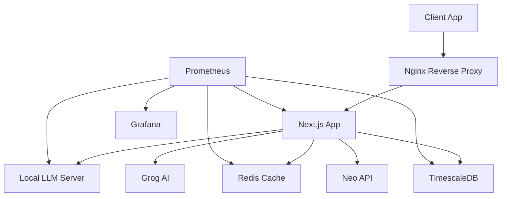

# Neon Nexus Infrastructure Guide

## Overview



## Docker Infrastructure

```yaml:docker-compose.metrics.yml
version: '3.8'

services:
  timescaledb:
    image: timescale/timescaledb:latest-pg15
    ports:
      - "5432:5432"
    environment:
      - POSTGRES_USER=neonexus
      - POSTGRES_PASSWORD=${DB_PASSWORD}
      - POSTGRES_DB=neonexus_metrics
    volumes:
      - timescale_data:/var/lib/postgresql/data
    healthcheck:
      test: ["CMD-SHELL", "pg_isready -U neonexus"]
      interval: 10s
      timeout: 5s
      retries: 5

  prometheus:
    image: prom/prometheus:latest
    ports:
      - "9090:9090"
    volumes:
      - ./prometheus:/etc/prometheus
      - prometheus_data:/prometheus
    command:
      - '--config.file=/etc/prometheus/prometheus.yml'
      - '--storage.tsdb.path=/prometheus'
      - '--web.console.libraries=/usr/share/prometheus/console_libraries'
      - '--web.console.templates=/usr/share/prometheus/consoles'

  grafana:
    image: grafana/grafana:latest
    ports:
      - "3000:3000"
    environment:
      - GF_SECURITY_ADMIN_PASSWORD=${GRAFANA_PASSWORD}
    volumes:
      - grafana_data:/var/lib/grafana
      - ./grafana/provisioning:/etc/grafana/provisioning
    depends_on:
      - prometheus
      - timescaledb

volumes:
  timescale_data:
  prometheus_data:
  grafana_data:
```

## Metrics Schema

```sql
-- Create hypertable for API metrics
CREATE TABLE api_metrics (
    time TIMESTAMPTZ NOT NULL,
    endpoint TEXT NOT NULL,
    response_time DOUBLE PRECISION,
    status_code INTEGER,
    api_type TEXT CHECK (api_type IN ('grog', 'neo', 'local')),
    success BOOLEAN
);

SELECT create_hypertable('api_metrics', 'time');

-- Create hypertable for model metrics
CREATE TABLE model_metrics (
    time TIMESTAMPTZ NOT NULL,
    model_name TEXT NOT NULL,
    tokens_used INTEGER,
    processing_time DOUBLE PRECISION,
    memory_usage DOUBLE PRECISION,
    gpu_usage DOUBLE PRECISION
);

SELECT create_hypertable('model_metrics', 'time');

-- Create hypertable for content analysis
CREATE TABLE content_analysis (
    time TIMESTAMPTZ NOT NULL,
    text_hash TEXT NOT NULL,
    text_length INTEGER,
    ai_score DOUBLE PRECISION,
    human_score DOUBLE PRECISION,
    metrics JSONB
);

SELECT create_hypertable('content_analysis', 'time');
```

## Prometheus Configuration

```yaml:prometheus/prometheus.yml
global:
  scrape_interval: 15s
  evaluation_interval: 15s

scrape_configs:
  - job_name: 'neonexus'
    static_configs:
      - targets: ['localhost:3001']
    metrics_path: '/metrics'

  - job_name: 'llm-server'
    static_configs:
      - targets: ['llm-server:8000']
    metrics_path: '/metrics'

  - job_name: 'redis'
    static_configs:
      - targets: ['redis:6379']
    metrics_path: '/metrics'

  - job_name: 'timescaledb'
    static_configs:
      - targets: ['timescaledb:5432']
    metrics_path: '/metrics'
```

## Grafana Dashboards

```json:grafana/dashboards/api_performance.json
{
  "dashboard": {
    "title": "API Performance",
    "panels": [
      {
        "title": "Response Time by API",
        "type": "graph",
        "datasource": "Prometheus",
        "targets": [
          {
            "expr": "rate(api_response_time_seconds_sum[5m])",
            "legendFormat": "{{api_type}}"
          }
        ]
      },
      {
        "title": "Success Rate",
        "type": "gauge",
        "datasource": "Prometheus",
        "targets": [
          {
            "expr": "sum(rate(api_requests_total{status='success'}[5m])) / sum(rate(api_requests_total[5m])) * 100"
          }
        ]
      }
    ]
  }
}
```

## Metrics Collection

```typescript:lib/metrics.ts
import { Counter, Histogram } from 'prom-client'

export const apiResponseTime = new Histogram({
  name: 'api_response_time_seconds',
  help: 'Response time in seconds',
  labelNames: ['api_type', 'endpoint']
})

export const apiRequests = new Counter({
  name: 'api_requests_total',
  help: 'Total number of API requests',
  labelNames: ['api_type', 'status']
})

export const modelMetrics = new Histogram({
  name: 'model_performance',
  help: 'Model performance metrics',
  labelNames: ['model_name', 'metric_type']
})
```

## Backup Strategy

```bash:scripts/backup.sh
#!/bin/bash

# Backup TimescaleDB
pg_dump -h localhost -U neonexus neonexus_metrics > backup/metrics_$(date +%Y%m%d).sql

# Backup Redis
redis-cli save
cp /data/dump.rdb backup/redis_$(date +%Y%m%d).rdb

# Backup Prometheus
tar -zcvf backup/prometheus_$(date +%Y%m%d).tar.gz /prometheus

# Backup Grafana
tar -zcvf backup/grafana_$(date +%Y%m%d).tar.gz /var/lib/grafana
```

## Monitoring Alerts

```yaml:prometheus/alerts.yml
groups:
  - name: neonexus_alerts
    rules:
      - alert: HighResponseTime
        expr: rate(api_response_time_seconds_sum[5m]) > 1
        for: 5m
        labels:
          severity: warning
        annotations:
          summary: High API response time

      - alert: LowSuccessRate
        expr: sum(rate(api_requests_total{status="success"}[5m])) / sum(rate(api_requests_total[5m])) < 0.95
        for: 5m
        labels:
          severity: critical
        annotations:
          summary: API success rate below 95%
```

## Scaling Strategy

1. **Horizontal Scaling**
   - Load balancer configuration
   - Session persistence
   - Cache synchronization

2. **Vertical Scaling**
   - Resource monitoring
   - Automatic scaling triggers
   - Performance thresholds

3. **Database Partitioning**
   - Time-based partitioning
   - Query optimization
   - Index management

## Security Measures

1. **Network Security**
   - VPC configuration
   - Firewall rules
   - SSL/TLS certificates

2. **Data Security**
   - Encryption at rest
   - Encryption in transit
   - Key rotation

3. **Access Control**
   - RBAC configuration
   - Audit logging
   - Session management

---

For API details, see:
- [API.md](./API.md)
- [GROG.md](./GROG.md)
- [NEO_API_INTEGRATION.md](./NEO_API_INTEGRATION.md) 