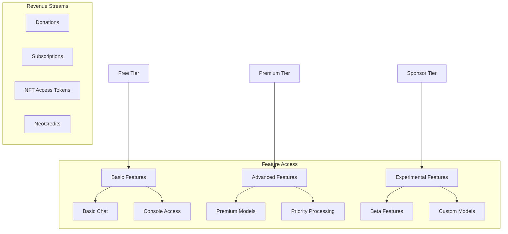

# Neon Nexus Monetisation Strategy 💰

## Overview



## Subscription Tiers

### 🌐 Free Tier
- Basic chat functionality
- Standard response time
- Access to console interface
- Limited model selection
- Basic metrics analysis

### 💎 Premium Tier ($9.99/month)
```typescript
interface PremiumFeatures {
  priorityQueue: boolean;        // Faster response times
  modelSelection: string[];      // Access to premium models
  mediaProcessing: {
    images: boolean;             // Image analysis
    audio: boolean;             // Audio transcription
    maxSize: number;            // 50MB
  };
  customization: {
    themes: boolean;            // Custom UI themes
    personalities: boolean;     // AI personality settings
  };
}
```

### 🚀 Sponsor Tier ($49.99/month)
```typescript
interface SponsorFeatures extends PremiumFeatures {
  experimentalAccess: boolean;   // Beta features
  customModels: boolean;         // Model fine-tuning
  streamPriority: boolean;       // Ultra-fast streaming
  voteWeight: number;           // Feature voting power
  neoCreditsBonus: number;      // Monthly NC bonus
}
```

## Special Features

### 🎙️ Audio Streaming
```typescript
interface AudioStreamConfig {
  quality: 'standard' | 'high' | 'ultra';
  models: {
    synthesis: 'basic' | 'premium' | 'custom';
    recognition: 'whisper-base' | 'whisper-large';
  };
  realtime: boolean;
  multilingualSupport: boolean;
}

const pricingTiers = {
  standard: 'Premium',  // Included in Premium
  high: 'Sponsor',     // Included in Sponsor
  ultra: 'Custom'      // Custom pricing
};
```

### 🎨 Media Processing
| Feature | Free | Premium | Sponsor |
|---------|------|---------|---------|
| Image Analysis | 5/day | Unlimited | Unlimited + Priority |
| Audio Processing | 1min/day | 60min/day | Unlimited |
| Video Analysis | ❌ | 10min/day | Unlimited |
| Custom Models | ❌ | ❌ | ✅ |

### ⚡ Priority Processing
```typescript
interface PriorityConfig {
  tier: 'free' | 'premium' | 'sponsor';
  queuePriority: number;        // 1-10
  maxConcurrent: number;        // Parallel requests
  processingPower: {
    cpu: number;                // CPU allocation
    gpu: number;                // GPU allocation
  };
}
```

## NeoCredits Economy

### 💫 Earning Methods
1. **Active Participation**
   - Quality conversations
   - Bug reports
   - Feature suggestions
   - Community help

2. **Subscription Rewards**
   ```typescript
   interface NCRewards {
     free: number;         // 100 NC/month
     premium: number;      // 1000 NC/month
     sponsor: number;      // 5000 NC/month + bonus
   }
   ```

3. **Achievement Bonuses**
   - Special events
   - Milestones
   - Hidden achievements

### 🏪 NC Marketplace
```typescript
interface MarketplaceItem {
  id: string;
  name: string;
  type: 'model' | 'feature' | 'cosmetic' | 'boost';
  price: number;          // In NeoCredits
  duration?: number;      // For temporary items
  rarity: 'common' | 'rare' | 'legendary';
}
```

## Donation System

### 🎁 One-Time Donations
```typescript
interface DonationTier {
  amount: number;
  rewards: {
    neoCredits: number;
    specialBadge: boolean;
    exclusiveAccess: string[];
    customization: boolean;
  };
}

const donationTiers = {
  supporter: { amount: 10, rewards: {...} },
  patron: { amount: 50, rewards: {...} },
  benefactor: { amount: 100, rewards: {...} }
};
```

### 🌟 Sponsorship Benefits
1. **Direct Feature Influence**
   - Vote on roadmap
   - Early access
   - Custom feature requests

2. **Technical Benefits**
   - Dedicated resources
   - Custom model training
   - API priority

3. **Recognition**
   - Special badges
   - Public acknowledgment
   - Exclusive events

## Future Monetisation Plans

### Phase 1: Enhanced Services
- [ ] Custom model training
- [ ] Advanced analytics
- [ ] Enterprise solutions

### Phase 2: Ecosystem Expansion
- [ ] NFT access tokens
- [ ] Marketplace expansion
- [ ] Partner integrations

### Phase 3: Enterprise Features
- [ ] Private deployments
- [ ] Custom security
- [ ] SLA guarantees

## Pricing Strategy

### Dynamic Pricing
```typescript
interface DynamicPricing {
  basePrice: number;
  factors: {
    usage: number;        // Usage volume
    demand: number;       // Current demand
    features: string[];   // Active features
  };
  discounts: {
    annual: number;       // Yearly subscription
    referral: number;     // Referral program
    loyalty: number;      // Long-term users
  };
}
```

### Enterprise Custom Pricing
- Volume discounts
- Custom feature sets
- Dedicated support
- Custom development

## Security & Compliance

1. **Payment Processing**
   - Secure payment gateway
   - Cryptocurrency support
   - Automatic billing

2. **Data Protection**
   - GDPR compliance
   - Data encryption
   - Privacy controls

3. **Usage Monitoring**
   - Fair use policy
   - Abuse prevention
   - Resource allocation

---

*All prices and features are subject to change. See Terms of Service for details.*
