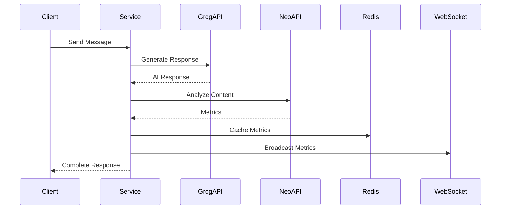

# Neo API Integration Guide

## Overview
Integration with [Neo API](https://neoapi.ai/) for content analysis and metrics collection.

## SDK Integration

Neo API предоставляет официальный Python SDK:
```bash
pip install neoapi-sdk
```

[](https://pypi.org/project/neoapi-sdk/)

```python
from neoapi_sdk import NeoApiClientAsync

client = NeoApiClientAsync(api_key="your_api_key")
response = await client.analyze_text("Your text here")
```

## Custom Implementation

For more control, we use a custom implementation:

```python
class NeoAPI:
    API_URL = "https://api.neoapi.ai/analyze"

    def __init__(self, api_key: str):
        self.api_key = api_key

    async def analyze_text(self, text: str) -> Dict[str, Any]:
        headers = {
            "Authorization": f"Bearer {self.api_key}",
            "Content-Type": "application/json"
        }
        
        payload = {
            "text": text,
            "project": "neoapi",
            "group": "playground",
            "analysis_slug": "playground",
            "full_metrics": True,
            "language": "auto"
        }

        # API call implementation...
```

## Flow Diagram


## API Integration

### Neo API Client
```python
class NeoAPI:
    API_URL = "https://api.neoapi.ai/analyze"

    def __init__(self, api_key: str):
        self.api_key = api_key

    async def analyze_text(self, text: str) -> Dict[str, Any]:
        headers = {
            "Authorization": f"Bearer {self.api_key}",
            "Content-Type": "application/json"
        }
        
        payload = {
            "text": text,
            "project": "neoapi",
            "group": "playground",
            "analysis_slug": "playground",
            "full_metrics": True,
            "language": "auto"
        }

        # API call implementation...
```

### Response Structure
```typescript
interface NeoAPIResponse {
  status: "success" | "error";
  text?: string;
  is_ai_generated: boolean;
  human_likeness_score: number;
  metrics: {
    text_coherence_complexity: Record<string, number>;
    readability_metrics: Record<string, number>;
    vocabulary_lexical_diversity: Record<string, number>;
    // ... other metrics
  };
}
```

## Error Handling

```python
try:
    response = await neo_api.analyze_text(text)
except Exception as e:
    return {
        "status": "error",
        "error": "Neo API connection failed",
        "is_ai_generated": False,
        "human_likeness_score": 0,
        "metrics": {}
    }
```

## Metrics Broadcasting

```python
async def broadcast_metrics(metrics: Dict[str, Any], websocket: WebSocketResponse):
    try:
        await websocket.send_json({
            "type": "metrics",
            "data": metrics
        })
    except Exception as e:
        logger.error(f"WebSocket broadcast error: {e}")
```

## Testing

```python
@pytest.mark.integration
async def test_neo_api_integration():
    api = NeoAPI(api_key)
    response = await api.analyze_text("Test message")
    assert response["status"] == "success"
    assert "metrics" in response
```

---

For metrics details, see [METRICS_ANALYSIS.md](./METRICS_ANALYSIS.md) 
