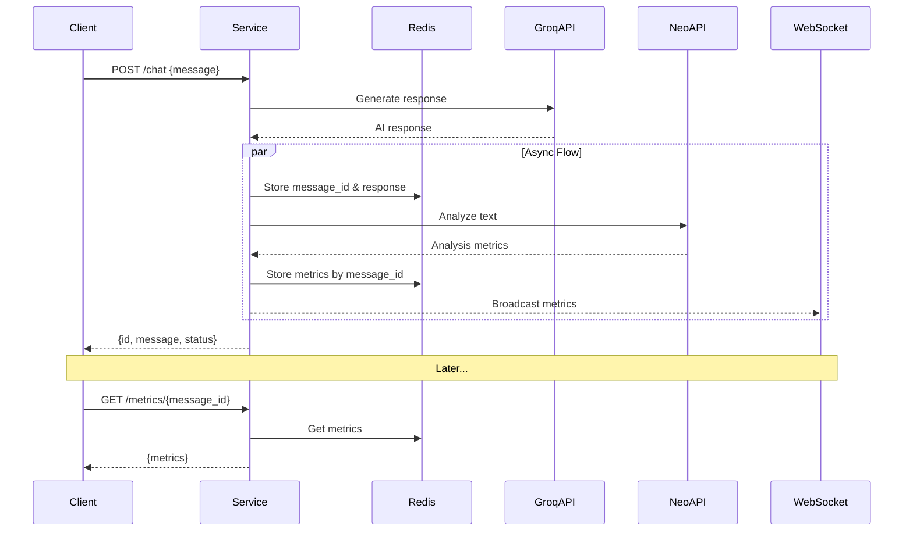

# NeonChat Service

Сервис обработки чат-сообщений с использованием Groq API для генерации ответов и Neo API для анализа текста.

## Архитектура



## Компоненты

### Core Services
- **HTTP Server (port 8000)**: Обработка чат-запросов
- **WebSocket Server (port 8001)**: Стриминг метрик анализа
- **Redis**: Хранение метрик и связей сообщений

### External APIs
- **Groq API**: Генерация ответов ИИ
- **Neo API**: Анализ текста и метрики

## Хранение данных

### Redis Schema
```
# Сообщения
message:{message_id} = {
    "text": str,
    "timestamp": datetime,
    "groq_response": str
}

# Метрики
metrics:{message_id} = {
    "is_ai_generated": bool,
    "human_likeness_score": float,
    "metrics": {
        "coherence": float,
        "complexity": float,
        ...
    },
    "timestamp": datetime
}

# Индексы
messages:by_date = sorted set(message_id by timestamp)
metrics:by_date = sorted set(message_id by timestamp)
```

## API Endpoints

### Chat API
```http
POST /chat
{
    "message": "Your message here"
}

Response:
{
    "id": "message_uuid",
    "message": "AI response",
    "status": "success"
}
```

### Metrics API
```http
GET /metrics/{message_id}

Response:
{
    "message_id": "uuid",
    "metrics": {
        "is_ai_generated": bool,
        "human_likeness_score": float,
        "metrics": {...}
    }
}
```

### WebSocket Events
```json
{
    "type": "metrics",
    "message_id": "uuid",
    "data": {
        "is_ai_generated": bool,
        "human_likeness_score": float,
        "metrics": {...}
    }
}
```

## Тестирование

### Структура тестов
```
tests/
├── unit/                  # Модульные тесты
│   ├── test_service.py   # Тесты основного сервиса
│   ├── test_redis.py     # Тесты работы с Redis
│   └── test_handlers.py  # Тесты обработчиков
│
├── integration/          # Интеграционные тесты
│   ├── test_groq.py     # Тесты Groq API
│   └── test_neo.py      # Тесты Neo API
│
└── e2e/                 # End-to-end тесты
    ├── test_chat.py     # Полный цикл чата
    └── test_metrics.py  # Тесты метрик
```

### Запуск тестов

1. Модульные тесты:
```bash
pytest tests/unit -v
```

2. Интеграционные тесты:
```bash
pytest tests/integration -v
```

3. E2E тесты:
```bash
pytest tests/e2e -v
```

4. Тесты с Redis:
```bash
pytest tests/integration/test_redis.py -v
```

### Тестовые сценарии

1. **Базовые проверки**
   - Health check endpoints
   - WebSocket соединения
   - Redis подключение

2. **Чат функциональность**
   - Отправка сообщений
   - Получение ответов
   - Обработка ошибок

3. **Метрики**
   - Сохранение в Redis
   - WebSocket уведомления
   - Lazy loading

4. **Интеграции**
   - Groq API тесты
   - Neo API тесты
   - Redis операции

## Локальная разработка

### Настройка окружения

1. Создание виртуального окружения:
```bash
python -m venv venv
source venv/bin/activate
```

2. Установка зависимостей:
```bash
pip install -r ../../requirements.txt
```

3. Настройка переменных окружения:
```bash
cp .env.example .env
# Отредактируйте .env файл, добавив ваши API ключи
```

### Запуск тестов

1. Модульные тесты:
```bash
cd src/service
pytest test_service.py -v
pytest neoapi/test_neoapi.py -v
pytest grog/test_grog.py -v
```

2. Тесты с покрытием:
```bash
pytest --cov=src/service --cov-report=html
```

### Структура тестов

```
src/service/
├── test_service.py          # Основные тесты сервиса
├── grog/
│   └── test_grog.py        # Тесты Groq API интеграции
└── neoapi/
    └── test_neoapi.py      # Тесты Neo API интеграции
```

#### Уровни тестирования:

1. **Unit Tests**
   - Тестирование отдельных компонентов
   - Моки внешних зависимостей
   - Быстрое выполнение

2. **Integration Tests**
   - Тестирование взаимодействия компонентов
   - Реальные API вызовы
   - Маркер @pytest.mark.integration

3. **E2E Tests**
   - Полный цикл обработки сообщений
   - WebSocket соединения
   - Docker окружение

## Docker

### Конфигурация

Переменные окружения:
```
GROQ_API_KEY=your_groq_api_key
NEO_API_KEY=your_neo_api_key
```

### Запуск через Docker

```bash
docker-compose up -d
```

### Автоматические тесты

Smoke-тесты после сборки:
```bash
./scripts/docker.sh
```

Скрипт выполняет:
1. Сборку и запуск контейнеров
2. Тест подключения к Groq API
3. Тест интеграции с Neo API
4. Проверку WebSocket соединения

## Разработка

### Code Style
```bash
# Форматирование кода
black src/service

# Сортировка импортов
isort src/service

# Проверка типов
mypy src/service

# Линтинг
flake8 src/service
```

### Pre-commit хуки
```bash
# Установка хуков
pre-commit install

# Запуск проверок
pre-commit run --all-files
```

# Тестирование NeonChat Service

## Уровни тестирования

### 1. Unit Tests
Тестирование отдельных компонентов в изоляции.

```
tests/
└── unit/
    ├── test_service.py     # Тесты основного сервиса
    ├── test_grog.py        # Тесты Groq API клиента
    └── test_neo.py         # Тесты Neo API клиента
```

Запуск:
```bash
pytest tests/unit -v
```

### 2. Integration Tests
Тестирование взаимодействия компонентов.

```
tests/
└── integration/
    ├── test_api_flow.py    # Тесты API взаимодействий
    ├── test_redis.py       # Тесты Redis интеграции
    └── test_websocket.py   # Тесты WebSocket
```

Запуск:
```bash
pytest tests/integration -v
pytest -m integration  # Тесты с маркером integration
```

### 3. Smoke Tests
Быстрые проверки основной функциональности.

```bash
# Через pytest
pytest tests/test_smoke.py -v

# Через скрипт
./scripts/docker.test.sh
```

### 4. HTTP Tests
REST-клиент тесты в docker.http:
- Health checks
- Chat API
- Metrics API
- WebSocket endpoints

## Структура тестов

### Unit Tests
```python
class TestServiceUnit:
    async def test_health_check(self, client):
        """Тест health endpoint"""
        resp = await client.get('/health')
        assert resp.status == 200

    async def test_chat_endpoint(self, client):
        """Тест chat endpoint"""
        resp = await client.post('/chat', json={'message': 'test'})
        assert resp.status == 200
```

### Integration Tests
```python
@pytest.mark.integration
class TestIntegration:
    async def test_full_flow(self):
        """Тест полного цикла"""
        # 1. Отправка сообщения
        # 2. Получение ответа от Groq
        # 3. Анализ через Neo API
        # 4. Проверка метрик в Redis
```

## Настройка тестового окружения

### 1. Зависимости
```bash
pip install pytest pytest-asyncio pytest-aiohttp pytest-cov
```

### 2. Конфигурация pytest
```ini
# pytest.ini
[pytest]
asyncio_mode = auto
markers =
    integration: marks tests as integration tests
    smoke: marks tests as smoke tests
```

### 3. Фикстуры
```python
# conftest.py
@pytest.fixture(scope="session")
def event_loop():
    """Фикстура для event loop"""
    loop = asyncio.get_event_loop_policy().new_event_loop()
    yield loop
    loop.close()

@pytest.fixture
async def client(aiohttp_client, app):
    """Фикстура для тестового клиента"""
    return await aiohttp_client(app)
```

## Запуск тестов

### 1. Локальная разработка
```bash
# Из директории src/service
pytest tests/ -v  # Все тесты
pytest tests/test_smoke.py -v  # Только smoke тесты
pytest tests/test_service.py -v  # Только unit тесты
pytest tests/ -v -m integration  # Только интеграционные тесты

# С покрытием кода
pytest --cov=src/service --cov-report=html

# Конкретный модуль
pytest tests/unit/test_service.py -v
```

### 2. В Docker
```bash
# Сборка и тесты
./scripts/docker.sh --test

# Только тесты
./scripts/docker.test.sh
```

### 3. Continuous Integration
```bash
# Полный набор тестов
pytest -v --cov=src/service --cov-report=xml

# Только smoke тесты
pytest tests/test_smoke.py -v
```

## Мониторинг и отладка тестов

### 1. Логирование
```bash
# Подробные логи тестов
pytest -v --log-cli-level=DEBUG

# Логи контейнера
docker logs neonchat-service
```

### 2. Отладка
```bash
# Остановка на первой ошибке
pytest -x

# Подробная информация об ошибках
pytest -vv --tb=long
```

### 3. Профилирование
```bash
# Время выполнения тестов
pytest --durations=10
```

## Лучшие практики

1. **Изоляция тестов**
   - Использование фикстур
   - Моки внешних сервисов
   - Очистка состояния после тестов

2. **Асинхронное тестирование**
   - Корректная настройка event loop
   - Использование async/await
   - Обработка таймаутов

3. **Интеграционные тесты**
   - Проверка реальных взаимодействий
   - Тестирование граничных случаев
   - Мониторинг производительности

## Тестирование API вручную

### Groq API

Прямой тест Groq API:
```bash
curl -X POST https://api.groq.com/openai/v1/chat/completions \
  -H "Authorization: Bearer ${GROQ_API_KEY}" \
  -H "Content-Type: application/json" \
  -d '{
    "model": "mixtral-8x7b-32768",
    "messages": [{"role": "user", "content": "Who are you?"}],
    "temperature": 0.7,
    "max_tokens": 1000
  }'
```

Пример ответа:
```json
{
  "id": "chatcmpl-...",
  "object": "chat.completion",
  "choices": [{
    "message": {
      "role": "assistant",
      "content": "I am a helpful assistant here to provide information..."
    }
  }],
  "usage": {
    "prompt_tokens": 12,
    "completion_tokens": 27,
    "total_tokens": 39
  }
}
```