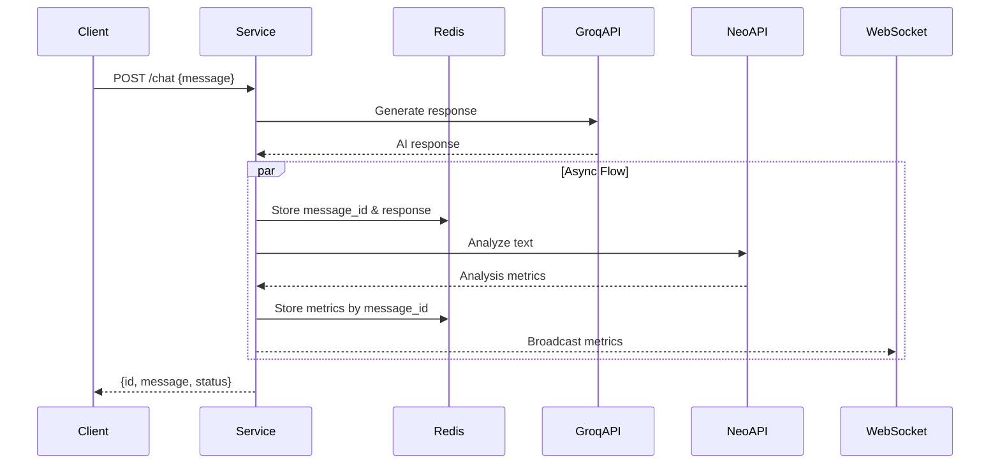

# NeonChat Service

Сервис обработки чат-сообщений с использованием Groq API для генерации ответов и Neo API для анализа текста.

## Быстрый старт

### 1. Локальный запуск
```bash
# Создание и активация виртуального окружения
python -m venv venv
source venv/bin/activate

# Установка зависимостей
pip install -r ../../requirements.txt

# Настройка окружения
cp .env.example .env
# Добавьте в .env ваши API ключи:
# GROQ_API_KEY=your_key
# NEO_API_KEY=your_key
```

### 2. Docker запуск
```bash
# Сборка и запуск
./scripts/docker.sh --test

# Только запуск тестов
./scripts/docker.test.sh
```

## Тестирование

### Основные команды
```bash
# Все тесты
pytest tests/ -v

# Unit тесты
pytest tests/unit -v

# Интеграционные тесты
pytest tests/integration -v

# Тесты с покрытием
pytest --cov=src/service --cov-report=html

# Smoke тесты
pytest tests/test_smoke.py -v
```

### HTTP тесты
Используйте REST-клиент тесты в `scripts/docker.http`:
```http
### Health Check
GET http://localhost:8000/health

### Chat API
POST http://localhost:8000/chat
Content-Type: application/json

{
    "message": "Test message"
}

### Metrics API
GET http://localhost:8000/metrics/{message_id}
```

## Code Style
```bash
# Форматирование
black src/service
isort src/service

# Линтинг
flake8 src/service
mypy src/service

# Pre-commit хуки
pre-commit install
pre-commit run --all-files
```

## Архитектура



## API Endpoints

### Chat API
```http
POST /chat
{
    "message": "Your message here"
}

Response:
{
    "id": "message_uuid",
    "message": "AI response",
    "status": "success"
}
```

### Metrics API
```http
GET /metrics/{message_id}

Response:
{
    "message_id": "uuid",
    "metrics": {
        "is_ai_generated": bool,
        "human_likeness_score": float,
        "metrics": {...}
    }
}
```

## Дополнительная информация

### Redis Schema
```
message:{message_id} = {
    "text": str,
    "timestamp": datetime,
    "groq_response": str
}

metrics:{message_id} = {
    "is_ai_generated": bool,
    "human_likeness_score": float,
    "metrics": {...},
    "timestamp": datetime
}
```

### Структура тестов
```
tests/
├── unit/                  # Модульные тесты
├── integration/          # Интеграционные тесты
└── e2e/                 # End-to-end тесты
```

### Компоненты
- HTTP Server (port 8000)
- WebSocket Server (port 8001)
- Redis
- Groq API
- Neo API

## Ручное тестирование API

### NeonChat Service API
```bash
# Тест chat endpoint
curl -X POST http://localhost:8000/chat \
  -H "Content-Type: application/json" \
  -d '{
    "message": "Who are you? Tell me about yourself in one sentence."
  }'

# Получение метрик
curl http://localhost:8000/metrics/{message_id}
```

### Groq API напрямую
```bash
curl -X POST https://api.groq.com/openai/v1/chat/completions \
  -H "Authorization: Bearer ${GROQ_API_KEY}" \
  -H "Content-Type: application/json" \
  -d '{
    "model": "mixtral-8x7b-32768",
    "messages": [{"role": "user", "content": "Who are you?"}],
    "temperature": 0.7,
    "max_tokens": 1000
  }'
```

Пример ответа от Groq API:
```json
{
  "id": "chatcmpl-...",
  "object": "chat.completion",
  "choices": [{
    "message": {
      "role": "assistant",
      "content": "I am a helpful assistant here to provide information..."
    }
  }],
  "usage": {
    "prompt_tokens": 12,
    "completion_tokens": 27,
    "total_tokens": 39
  }
}
```

### Neo API напрямую
```bash
curl -X POST https://api.neo.example.com/analyze \
  -H "Authorization: Bearer ${NEO_API_KEY}" \
  -H "Content-Type: application/json" \
  -d '{
    "text": "Your text to analyze"
  }'
```